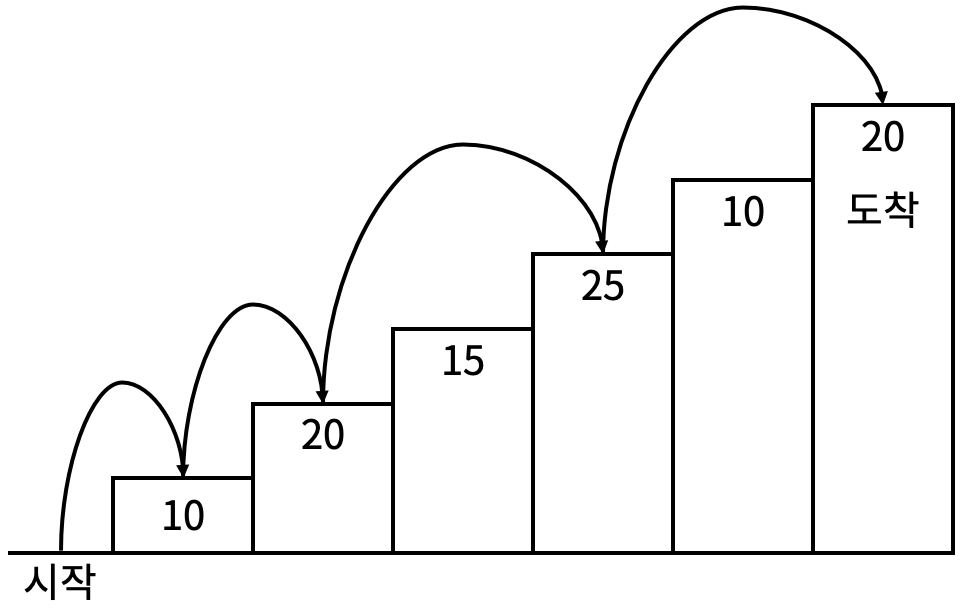

---

layout: post
title: 동적 프로그래밍
date: 2023-12-21 00:00:00 +0800
categories: [CS Study, algorithm]
tags: [Sophomore, CodingTest]
pin: true

---

## 동적 프로그래밍
학교 알고리즘 수업시간에 배운 동적 계획 알고리즘을 적용해보기 위해서 백준 사이트에 동적 프로그래밍 문제 위주로 풀어보았다.
리스트에서 다음 요소를 어떻게 셋팅할 것인지의 점화식을 세우고 고민하는 과정이 정말 재미있었다.

### 1로 만들기
정수 X에 사용할 수 있는 연산은 다음과 같이 세 가지 이다.

1. X가 3으로 나누어 떨어지면, 3으로 나눈다.
2. X가 2로 나누어 떨어지면, 2로 나눈다.
3. 1을 뺀다.  

정수 N이 주어졌을 때, 위와 같은 연산 세 개를 적절히 사용해서 1을 만들려고 한다. 연산을 사용하는 횟수의 최솟값을 출력하시오.

### 입력
첫째 줄에 1보다 크거나 같고, 106보다 작거나 같은 정수 N이 주어진다.

### 출력
첫째 줄에 연산을 하는 횟수의 최솟값을 출력한다.

**정답 코드**
```python
n = int(input())

count = [0,0,1,1]
if n > 3:
    for i in range(4,n+1):
        b = float("inf")
        c = float("inf")
        if i%2 == 0:
            b = count[int(i/2)] + 1
        if i%3 == 0:
            c = count[int(i/3)] + 1
        count.append(min(count[i-1]+1,b,c))

print(count[n])
```  
n이 3이하인 경우까지 배열에 넣어주고, 3으로 나누어 떨어지는 경우, 2로 나누어 떨어지는 경우, 1을 빼는 경우 중에 가장 작은 값을 append 해준다.  

동적 프로그래밍은 그 자체로 어렵기도 하지만, 이 문제가 동적 계획을 이용해야하는지 캐치해야하는 것이 관건인 것 같다. 관련 문제를 많이 풀면서 감을 익히는 것이 중요한 것 같다.

### 2×n 타일링 2
2×n 직사각형을 1×2, 2×1과 2×2 타일로 채우는 방법의 수를 구하는 프로그램을 작성하시오.  

아래 그림은 2×17 직사각형을 채운 한가지 예이다.  
  

### 입력
첫째 줄에 n이 주어진다. (1 ≤ n ≤ 1,000)

### 출력
첫째 줄에 2×n 크기의 직사각형을 채우는 방법의 수를 10,007로 나눈 나머지를 출력한다.

**정답 코드**
```python
n = int(input())
arr = [0,1,3]

if n >= 3:
    for i in range(3,n+1):
        arr.append(arr[i-2]*2 + arr[i-1])

print(arr[n]%10007)
```  
1. 마지막 두 칸이 정사각형으로 이루어져있는 경우 : arr[i-2]
2. 마지막 두 칸이 눕혀져있는 직사각형으로 이루어져있는 경우 : arr[i-2]
3. 마지막 한 칸이 세워져있는 직사각형으로 이주어져있는 경우 : arr[i-1]  

이 경우들을 모두 더한 값을 다음 요소에 넣어준다.

### 계단 오르기
계단 오르기 게임은 계단 아래 시작점부터 계단 꼭대기에 위치한 도착점까지 가는 게임이다.  
예를 들어 <그림 2>와 같이 시작점에서부터 첫 번째, 두 번째, 네 번째, 여섯 번째 계단을 밟아 도착점에 도달하면 총 점수는 10 + 20 + 25 + 20 = 75점이 된다.  


계단 오르는 데는 다음과 같은 규칙이 있다.

1. 계단은 한 번에 한 계단씩 또는 두 계단씩 오를 수 있다. 즉, 한 계단을 밟으면서 이어서 다음 계단이나, 다음 다음 계단으로 오를 수 있다.
2. 연속된 세 개의 계단을 모두 밟아서는 안 된다. 단, 시작점은 계단에 포함되지 않는다.
3. 마지막 도착 계단은 반드시 밟아야 한다.  

따라서 첫 번째 계단을 밟고 이어 두 번째 계단이나, 세 번째 계단으로 오를 수 있다. 하지만, 첫 번째 계단을 밟고 이어 네 번째 계단으로 올라가거나, 첫 번째, 두 번째, 세 번째 계단을 연속해서 모두 밟을 수는 없다.

각 계단에 쓰여 있는 점수가 주어질 때 이 게임에서 얻을 수 있는 총 점수의 최댓값을 구하는 프로그램을 작성하시오.

### 입력
입력의 첫째 줄에 계단의 개수가 주어진다.

둘째 줄부터 한 줄에 하나씩 제일 아래에 놓인 계단부터 순서대로 각 계단에 쓰여 있는 점수가 주어진다. 계단의 개수는 300이하의 자연수이고, 계단에 쓰여 있는 점수는 10,000이하의 자연수이다.

### 출력
첫째 줄에 계단 오르기 게임에서 얻을 수 있는 총 점수의 최댓값을 출력한다.

**정답 코드**
```python
n = int(input())
stair = [0]

for i in range(n):
    stair.append(int(input()))

arr_1 = [0, stair[1]]
arr_2 = [0, 0]

if n >= 2:
    for i in range(2,n+1):
        arr_1.append(max(arr_1[i-2]+stair[i], arr_2[i-2]+stair[i]))
        arr_2.append(arr_1[i-1]+stair[i])
    print(max(arr_1[n], arr_2[n]))
else:
    print(arr_1[n])
```  


점화식이 정말 재미있는 문제이다. 배열을 두 개로 나눠서 각 계단까지 올라갔을 때, 
연속해서 밟은 계단이 1개인 경우와, 2개인 경우를 나눠서 배열에 저장시킨다. 

### 1, 2, 3 더하기
정수 n이 주어졌을 때, n을 1, 2, 3의 합으로 나타내는 방법의 수를 구하는 프로그램을 작성하시오.

### 입력
첫째 줄에 자연수 S(1 ≤ S ≤ 4,294,967,295)가 주어진다.

### 출력
각 테스트 케이스마다, n을 1, 2, 3의 합으로 나타내는 방법의 수를 출력한다.

**정답 코드**
```python
n = int(input())
arr = []

for i in range(n):
    arr.append(int(input()))

dp = [0, 1, 2, 4]

for i in range(4, 11):
    dp.append(dp[i-1]+dp[i-2]+dp[i-3])

for i in arr:
    print(dp[i])
```  

n<4일 때의 경우의 수까지 arr를 채워주고, `dp[i-1]+dp[i-2]+dp[i-3]` 다음 점화식을 이용하면 되는 기본 문제이다.  


### Four Squares
자연수 n이 주어질 때, n을 최소 개수의 제곱수 합으로 표현하는 컴퓨터 프로그램을 작성하시오.

### 입력
입력은 표준입력을 사용한다. 입력은 자연수 n을 포함하는 한 줄로 구성된다. 여기서, 1 ≤ n ≤ 50,000이다.

### 출력
출력은 표준출력을 사용한다. 합이 n과 같게 되는 제곱수들의 최소 개수를 한 줄에 출력한다.

**정답 코드**
```python
n = int(input())
arr = [float("inf")]*(n+1)

for i in range(1, n+1):
    for j in range(1, 225):
        if i == j**2: # 해당 요소가 제곱수일 경우 최소 개수는 1이 됨
            arr[i] = 1
        elif i > j**2:
            if arr[i] > arr[i-j**2] + 1:
                arr[i] = arr[i-j**2] + 1
        else:
            break

print(arr[n])
```  

이렇게 점화식을 설정하면 라그랑주의 증명에서 알 수 있다시피, 최소 개수는 4를 넘어가지 않는다.
물론 이 문제에서는 n이 50000 이하의 자연수까지만 확인하기 때문에, 50000의 제곱근보다 조금 큰 225까지만 브루트포스로 확인하였다.  

대부분의 동적 프로그래밍 문제는 배열의 크기를 얼마로 설정해야할지 주어지기 때문에 
`arr = [float("inf")]*(n+1)` 
이런식으로 배열의 크기를 확정하고 푸는 것이 좋다는 것을 알았다.  

### 파도반 수열
  

파도반 수열 P(N)은 나선에 있는 정삼각형의 변의 길이이다. P(1)부터 P(10)까지 첫 10개 숫자는 1, 1, 1, 2, 2, 3, 4, 5, 7, 9이다. 
N이 주어졌을 때, P(N)을 구하는 프로그램을 작성하시오.

### 입력
첫째 줄에 테스트 케이스의 개수 T가 주어진다. 각 테스트 케이스는 한 줄로 이루어져 있고, N이 주어진다. (1 ≤ N ≤ 100)

### 출력
각 테스트 케이스마다 P(N)을 출력한다.

**정답 코드**
```python
n = int(input())
arr = []

for i in range(n):
    arr.append(int(input()))

dp = [0, 1, 1, 1, 2, 2, 3, 4, 5, 7, 9]

for i in range(11, 101):
    dp.append(dp[i-1]+dp[i-5])

for i in arr:
    print(dp[i])
```  
10까지의 요소는 문제에서 주어졌기 때문에 배열에 채워주고,
다음 i번째 정삼각형의 변의 길이는 i-1번째의 정삼각형의 변과 i-5번째의 정삼각형의 변의 합임을 구현해준다.  


### 구간 합 구하기 4
수 N개가 주어졌을 때, i번째 수부터 j번째 수까지 합을 구하는 프로그램을 작성하시오.

### 입력
첫째 줄에 수의 개수 N과 합을 구해야 하는 횟수 M이 주어진다. 둘째 줄에는 N개의 수가 주어진다. 수는 1,000보다 작거나 같은 자연수이다. 셋째 줄부터 M개의 줄에는 합을 구해야 하는 구간 i와 j가 주어진다.

### 출력
총 M개의 줄에 입력으로 주어진 i번째 수부터 j번째 수까지 합을 출력한다.


**시간 초과된 코드**
```python
n, m = map(int,input().split())
arr = list(map(int,input().split()))
plus = [list(map(int,input().split())) for _ in range(m)]

for i in plus:
    print(sum(arr[i[0]-1:i[1]]))
```  
이보다 완벽할 순 없는 코드라고 생각했는데,, 시간 초과가 나와서 결국 구글링을 해서 답을 확인했다.  
주어진 n개의 수를 이용하여 합을 구하는 것을 1 ≤ M ≤ 100,000번 반복해야하기 때문에 각 요소까지의 합을 구해놓고 시작하는 것이 시간복잡도 측면에서 효율적이다. 단 한 번의 뺄셈만으로 i번째 수부터 j번째 수까지를 구할 수 있기 때문이다.

**정답 코드**
```python
n, m = map(int,input().split())
arr = list(map(int,input().split()))
plus = [list(map(int,input().split())) for _ in range(m)]

dp = [0]

for i in range(1,n+1):
    dp.append(dp[i-1]+arr[i-1])

for i in plus:
    print(dp[i[1]]-dp[i[0]-1])
```

