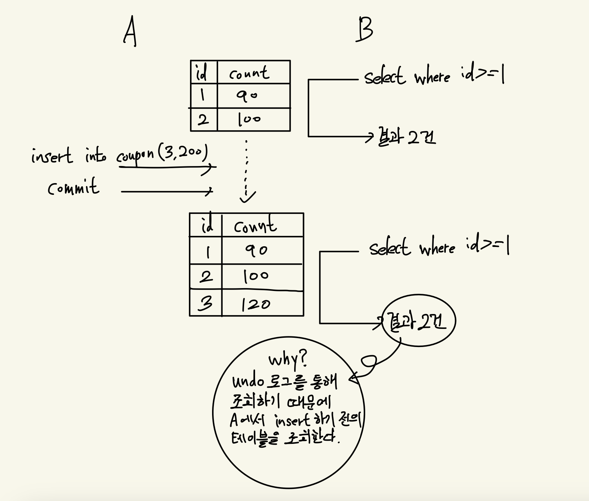

---

layout: post
title: 데이터베이스의 대표적인 이상 현상 6가지
date: 2024-10-03 00:00:00 +0800
categories: [CS Study, database]
tags: [Sophomore, database]
pin: true

---

### 1. Dirty Read (오손 읽기)

  

A에서 insert한 데이터를 B에서 조회한 뒤, A가 Rollback되면, B에서는 조회했던 정보가 사라진 셈이 되며, 트랜잭션의 일관성이 훼손된다.  

이 문제는 Read Uncommited 격리 수준에서만 발생하며, 격리 수준을 Read Commited로 올리면 오손 읽기 문제는 발생하지 않는다.  

하지만, 격리 수준을 Read Committed로 올리더라도, 반복 불가능 읽기 문제가 발생한다.

 

### 2. Non-repeatable Read (반복 불가능 읽기)

  
Read Committed에서는 커밋된 정보는 읽을 수 있다는 특징이 있다. 다른 말로, 커밋되지 않은 정보는 조회하지 않기 때문에, 오손 읽기 문제는 발생하지 않는다.  

하지만, 위의 그래프에서 볼 수 있다시피 A에서 커밋된 데이터를 B에서 조회할 수 있기 때문에, B의 조회 내용이 달라질 수 있다.  

이 문제도 격리 수준을 Repeatable Read로 올리면 해결된다. Repeatable Read에서는 undo 로그를 이용하여 조회 결과가 달라지지 않게 함으로써 트랜잭션의 일관성을 보장하기 때문이다.

 

### 3. Phantom Read (유령 읽기)  

  
다음과 같이, Repeatable Read 격리 수준에서는 undo 로그를 이용하기 때문에, 순수 select를 이용했을 때는 트랜잭션의 일관성이 보장된다.  

하지만, 아래의 상황을 보자.

 

  
이처럼, FOR UPDATE 조회를 하게 되면, undo 로그가 아닌 원본 데이터를 조회하게 되면서, A에서 커밋된 데이터가 조회되어서 B 트랜잭션의 일관성이 깨진다.  

 

**하지만, 일반적인 DBMS와 달리, MySQL에서는 FOR UPDATE 조회가 실행된 레코드에 대해서는 갭 락(Gap Lock)을 걸어서, 다른 트랜잭션에서 update나 insert를 할 수 없게 막는다!!** 따라서, MySQL에서는 유령 읽기 문제가 발생하지 않는다.

 

### 4. Lost Update (갱신 손실)  

갱신 손실은 다른 트랜잭션에 의해 데이터의 수정 내용이 덮어지는 현상이다.  

  

그래프를 보면 알 수 있듯이, Read Committed와 Read Uncommitted에서는 자주 발생할 수 있는 현상이다. 그리고, Repeatable Read에서도 발생할 수 있으나, MySQL에서는 FOR UPDATE 조회를 이용하여 갱신 손실 문제를 막을 수 있다.  

(MySQL에서) A와 B 각각 처음에 조회할 때, select FOR UPDATE를 이용해주면, 둘 중 하나는 대기 상태가 되며, 다른 하나의 트랜잭션이 commit 될 때까지 기다린다. 따라서 갱신이 손실되는 문제는 발생하지 않는 것이다.  

참고로, 갱신 손실 문제는 SERIALIZABLE 격리 수준에서 발생하지 않는다.

 

### 5. Write Skew (쓰기 스큐)  

사람1, 사람2 둘 중 한 명은 무조건 근무를 하고 있어야하는 상황이라고 가정해보자.  

그런데, A트랜잭션과 B트랜잭션이 동시에 조회를 해서 둘 다 근무 중이라고 판단해버리면 다음과 같은 상황이 나타날 수 있다.  

  

데이터베이스의 오류라고 볼 수는 없지만, 정책적으로는 치명적인 문제가 발생한다.  

update가 될 때, update 대상 요소가 select된 요소들의 영향을 받을 때 발생하는 것이므로, select된 update가 되고, commit이 되기 전까지는 다른 트랜잭션에서 select를 못하도록 막아줄 필요가 있는 것이다.  

쓰기 스큐 문제를 해결하는 방법으로는 아래 3가지 방법 정도가 있다.  
1. 비관적 잠금 (FOR UPDATE 조회)
2. 낙관적 잠금 (version을 이용)
3. SERIALIZABLE 격리 수준  

1번의 경우, FOR UPDATE로 조회함으로써 다른 트랜잭션이 아예 FOR UPDATE 조회를 하지 못하도록 한다. 2번의 경우, update마다 version을 남겨서 version이 맞지 않으면, update 시키지 못하도록 하는 방식이다. SERIALIZABLE 격리 수준은 모든 트랜잭션을 직렬화하는 것처럼 만들기 때문에, 쓰기 스큐를 가장 확실하게 방지할 수 있다.

 

### 6. Dead Lock (데드 락)  

데드 락은 A는 X에 대한 락을 가지고 있고, B는 Y에 대한 락을 가지고 있을 때, 서로의 자원에 락을 획득하려고 시도하면 무한 순환에 빠지게 되는 현상이다.  

  

**해결 방식**  
X도 A, B에 대한 락이 필요하고, Y도 A, B에 대한 락이 필요한 상황에서 발생할 수 있는 문제이므로, 자원에 순서를 정해줌으로써 이 문제를 해결할 수 있다. A와 B가 필요한 로직에 대해서는 A에 대한 락을 먼저 획득하고, 그 다음 B에 대한 락을 획득하도록 순서를 정해주면, A에 대한 락을 획득해야만, B에 대한 락을 획득할 수 있기 때문에, 순환에 빠지지 않게 된다. 